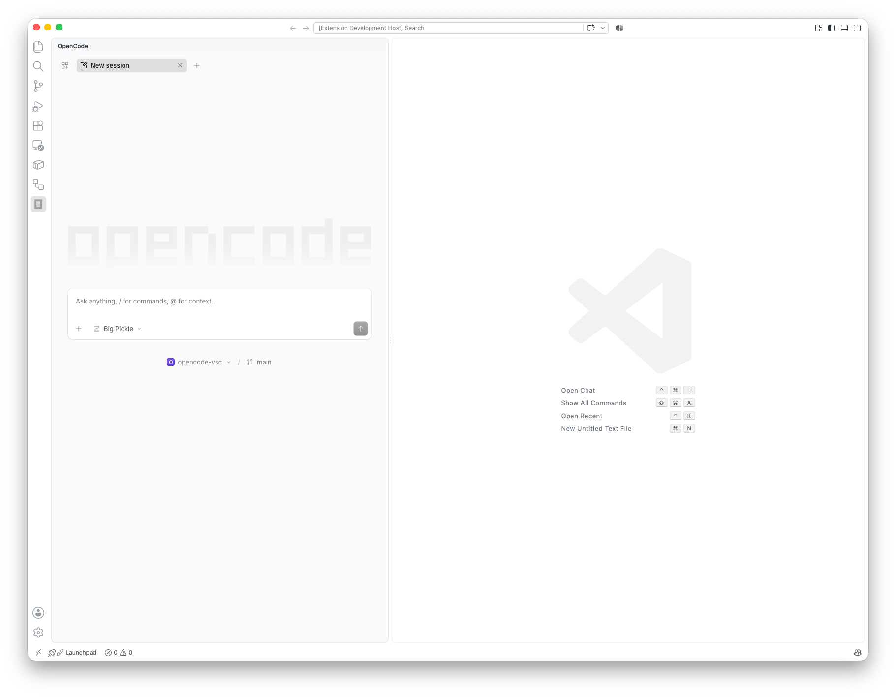

# OpenCode Extension for VS Code

AI coding agent for VS Code, powered by OpenCode.

[github.com/bilalbentoumi/opencode-vsc](https://github.com/bilalbentoumi/opencode-vsc)

## Overview

OpenCode Terminal embeds **OpenCode's web UI** in a VS Code side panel. It spawns an external `opencode serve` process and loads the official UI at `http://127.0.0.1:<port>/<workspace-dir>` in a webview iframe — sharing the exact same binary, config, auth, providers, MCP servers, agents, and rules as the terminal TUI.

No custom terminal emulator, no xterm.js, no node-pty — just OpenCode's own UI.

The `opencode` binary is not bundled: install and authenticate it once, and the extension drives it from inside the editor.

For more information, visit the repository.

## Requirements

- [OpenCode CLI](https://opencode.ai) (`opencode` on PATH, or set `opencode-vsc.command` to a full path).
- VS Code 1.90+.

## Features

- OpenCode in the Activity Bar side panel via a webview iframe.
- Shares the exact same config as the terminal TUI (MCP servers, agents, rules, auth, providers) because it runs the same binary against the same config files.
- Auto-manages the server process: starts it when the panel opens, stops it when the panel closes or the extension deactivates.
- Robust PATH resolution: checks `PATH`, common install locations (`~/.opencode/bin`, Homebrew, `/usr/local`), then falls back to your login shell (`zsh`/`bash`) — works even when VS Code is launched from Finder.
- Fixed ports, so URLs stay stable across restarts: the server on `4097`, the bridge proxy the panel actually loads on `4098`.
- `Restart` button in the panel title bar.

## Configuration

| Setting                | Default    | Description                                                                                                                                     |
| ---------------------- | ---------- | ----------------------------------------------------------------------------------------------------------------------------------------------- |
| `opencode-vsc.command` | `opencode` | Command (or full path) used to launch the OpenCode server.                                                                                      |
| `opencode-vsc.cwd`     | `""`       | Directory the server runs in. Empty = workspace folder of the active editor (falling back to the first workspace folder, then your home directory). |

Ports are fixed, not configurable: the OpenCode server listens on `4097`, and the
bridge-injecting proxy — the origin the panel iframe actually loads — on `4098`.

## Commands

- `OpenCode: Focus Side Panel` — open/focus the side panel.
- `OpenCode: Restart Session` — restart the server and reload the UI (also available as a panel title-bar button).

## Issues

Found a bug or have a feature request? Please open an issue on GitHub.

## License

OpenCode is released under the MIT License. It embeds the MIT-licensed OpenCode web UI through its documented `serve` interface.
